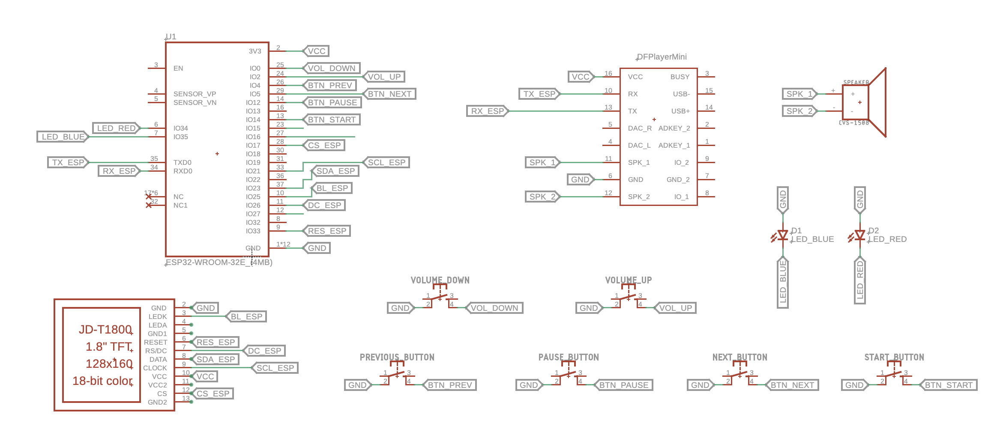
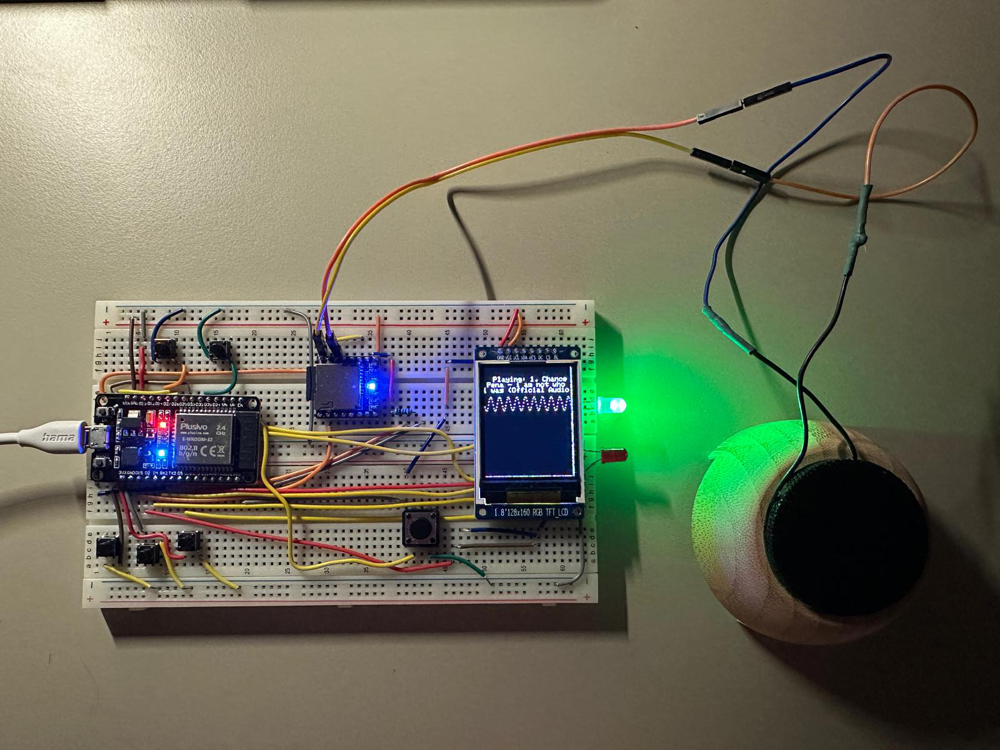

# 🎵 MP3 Player

## 📖 Introduction

This project is a small MP3 player with basic functionalities such as playing the previous or next track, adjusting the volume, and displaying the song on a 1.8" LCD screen. The songs are read from an SD card and played through a speaker. While it may not be the most robust or portable MP3 player, it is a personal project that reflects numerous days and nights of effort. The design is inspired by the character BMO from the show "Adventure Time," and it serves both as a functional MP3 player and a decorative piece for your desk.

## 🎯 General Description

The goal of this project was to create a standalone MP3 player that allows users to listen to their favorite music without interruptions from ads or relying on external service providers. The MP3 player is designed to be a fun and nostalgic piece of tech, with a unique and cute design.

## 🛠️ Hardware Design

### Schematic

Below is the electrical schematic of the project:

  

### Components List

- ESP32
- LCD ST7735
- DFPlayerMini
- Speaker 4 ohm, 5W
- 6 buttons
- Green 5mm LED
- Red 5mm LED
- Wires and jumpers
- 2x breadboards
- MicroSD card

## 💻 Software Design

### Development Environment

The project was developed using VSCode with the PlatformIO extension. The Arduino IDE was initially considered, but VSCode was chosen for its cleaner code management and familiarity.

### Libraries Used

- **HomeSpan**: For connecting with iOS and controlling via Siri.
- **Adafruit_ST7735**: For displaying on the LCD screen.
- **DFRobotDFPlayerMini**: For reading and decoding songs from the DFPlayerMini module.

### Implementation

The memory card contains the songs to be played. Below, I explain the key sections of the code used in the project.

_Include code snippets or explanations of key code sections._

The full code can be found on GitHub: [MP3 Player Project](https://github.com/Cipppp/MP3-player).

## 🎨 Results

  

## 🚀 Future Developments

- Add a larger LCD screen with more display functionalities.
- Incorporate a radio module for additional features.
- Add an amplifier for the speaker to enhance sound quality.
- Design a more interactive case for the MP3 player.
- Implement unit tests for the software components.
- Integrate an RGB LED strip that changes color based on the song.
- Include a 3.5mm jack for headphones.

## 📅 Project Timeline

- **April 14**: Ordered components.
- **April 22**: Received components.
- **April 24**: Burned the first DFPlayerMini module by incorrectly wiring GND to VCC. Ordered a replacement.
- **April 28**: Project nearly completed, but wires were messy.
- **April 29**: Spent an entire day replacing wires with jumpers, burned the DFPlayerMini module again due to the same mistake, ordered two replacements.
- **May 2**: Started designing the 3D case, still iterating on the design.

## 📚 Bibliography/Resources

- [DFRobotDFPlayerMini GitHub Repository](https://github.com/DFRobot/DFRobotDFPlayerMini)
- [DFPlayer Mini Wiki](https://wiki.dfrobot.com/DFPlayer_Mini_SKU_DFR0299)
- [Nick Koumaris’ MP3 Player Project](https://www.electronics-lab.com/project/mp3-player-using-arduino-dfplayer-mini/)
- [Michael Miller’s DFMiniMp3 Library](https://github.com/Makuna/DFMiniMp3)

## 📝 Conclusion

This was an interesting and fun project to work on, despite the numerous challenges, especially with the hardware components and library interactions. Finding the right speaker was particularly difficult, but overall, it was a rewarding experience to create something tangible and functional.

## 📦 Download

You can download all project files, including source code, schematics, and documentation, from the [GitHub repository](https://github.com/Cipppp/MP3-player).